# Firmspace CRM — шот-лист для видеообзора

- Кадров: **68** · общая длительность: **05:33** · разрешение 1920×1080
- Таймкоды — это моменты начала и конца кадра при монтаже по порядку (формат ММ:СС). Между кадрами советуем кроссфейд 0,4–0,6 с поверх соседних, на общую длительность он не влияет.
- Файл кадра: `S<номер>_<начало>_<название>.png`; те же данные — в `manifest.json`.
- «Озвучка» — текст диктора (RU). «Подпись» — короткий титр на экране (EN, как в интерфейсе). «Промпт» — готовое описание анимации для генератора видео (Runway, Kling, Veo, Luma и т. п.) или для After Effects / Figma Motion.

## Общий стиль для всех промптов
Dark premium SaaS product video, UI is dark graphite with neon-lime (#c6ff4d) accents, crisp 1920×1080 screen recording look, smooth easing, 60 fps, subtle depth and soft glow, no text distortion, keep all UI text legible, no watermarks.

## Оглавление по разделам
- **Intro** — 00:00–00:13 (3 кадр.)
- **Dashboard** — 00:13–00:24 (2 кадр.)
- **AI assistant** — 00:24–00:30 (1 кадр.)
- **Header** — 00:30–00:38 (2 кадр.)
- **Collaboration** — 00:38–01:37 (12 кадр.)
- **CRM** — 01:37–02:22 (8 кадр.)
- **My company** — 02:22–02:36 (3 кадр.)
- **Tasks & projects** — 02:36–03:01 (5 кадр.)
- **Accounting** — 03:01–04:04 (13 кадр.)
- **Marketing** — 04:04–04:31 (6 кадр.)
- **Automation** — 04:31–04:50 (4 кадр.)
- **Plans** — 04:50–04:55 (1 кадр.)
- **Settings** — 04:55–05:23 (6 кадр.)
- **Admin** — 05:23–05:28 (1 кадр.)
- **Outro** — 05:28–05:33 (1 кадр.)

---

## Intro

### 01 · 00:00–00:04 · title-card

- **Длительность:** 4 с
- **Озвучка (RU):** Firmspace CRM — продажи, общение с клиентами, задачи и бухгалтерия в одном окне. Давайте посмотрим, как это работает.
- **Подпись на экране (EN):** Firmspace CRM — product tour
- **Промпт для анимации:** Dark background with soft neon-lime light streaks sweeping across; the logo mark draws itself, then the title 'Firmspace CRM' fades up letter by letter with a subtle glow; ends on a gentle zoom-out.

### 02 · 00:04–00:09 · landing-hero
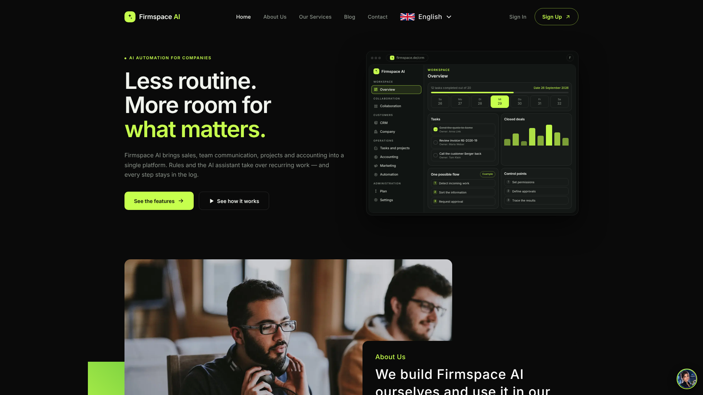

- **Длительность:** 5 с
- **Озвучка (RU):** Firmspace CRM — платформа, которая собирает продажи, общение с клиентами, задачи и бухгалтерию в одном окне.
- **Подпись на экране (EN):** Firmspace CRM — everything in one workspace
- **Промпт для анимации:** Hero section reveal: headline words fade up one by one, product mockup floats in with a slight 3D tilt, neon-lime gradient glow pulses behind.

### 03 · 00:09–00:13 · login
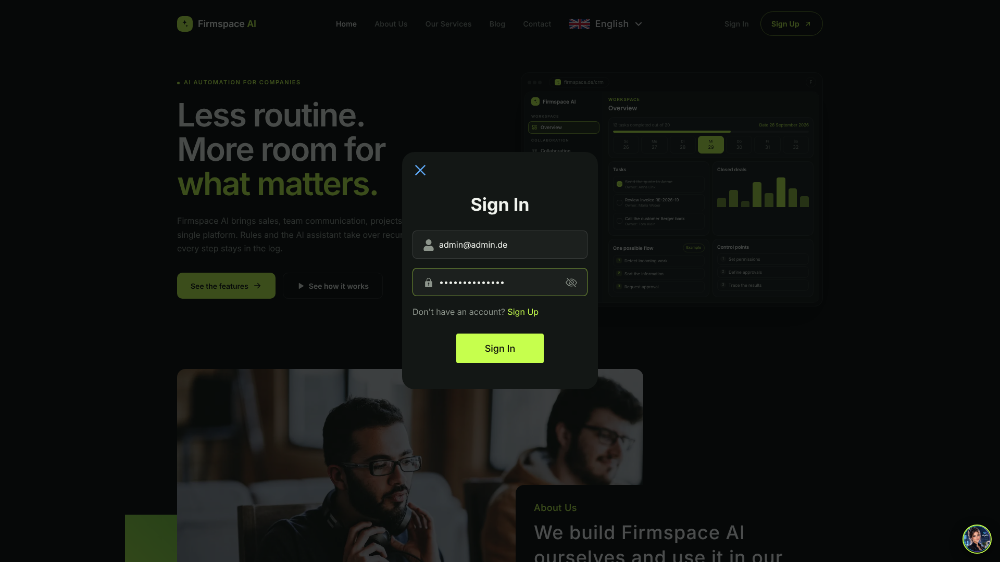

- **Длительность:** 4 с
- **Озвучка (RU):** Входим в личный кабинет по e-mail и паролю.
- **Подпись на экране (EN):** Sign in
- **Промпт для анимации:** Login modal scales in over a blurred hero, email text types in, password dots appear, sign-in button glows and pulses.

## Dashboard

### 04 · 00:13–00:19 · dashboard-overview
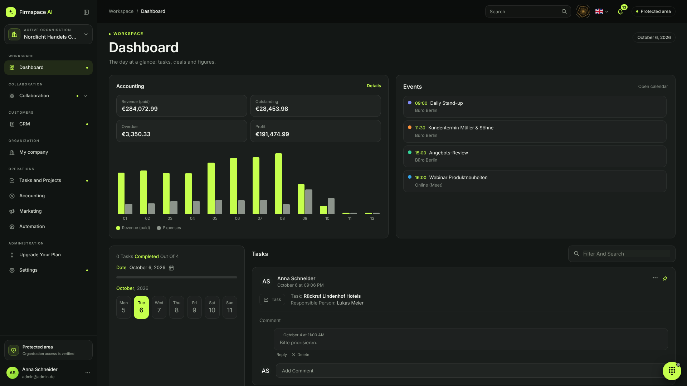

- **Длительность:** 6 с
- **Озвучка (RU):** Добро пожаловать в Firmspace CRM. Главный экран показывает день целиком: события, задачи на сегодня, объявления команды и ключевые цифры.
- **Подпись на экране (EN):** Your whole day at a glance
- **Промпт для анимации:** Slow cinematic push-in on a dark dashboard UI, neon-lime accents glow softly; widgets (events, tasks, announcements) fade and slide in one by one from the bottom with a subtle parallax; smooth 60fps, premium SaaS promo style.

### 05 · 00:19–00:24 · dashboard-charts
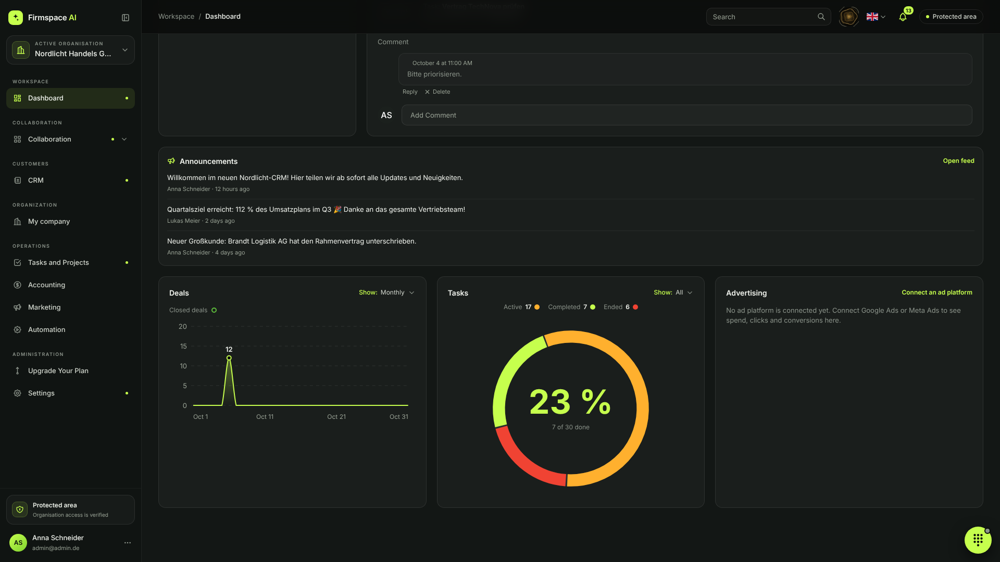

- **Длительность:** 5 с
- **Озвучка (RU):** Ниже — динамика закрытых сделок и прогресс по задачам. Видно, сколько выполнено, что в работе и что просрочено.
- **Подпись на экране (EN):** Deals and tasks analytics
- **Промпт для анимации:** Camera scrolls down the dashboard; the line chart draws itself from left to right and the donut chart fills clockwise with lime, orange and red segments while the percentage counts up; soft glow, clean motion graphics.

## AI assistant

### 06 · 00:24–00:30 · iris-assistant
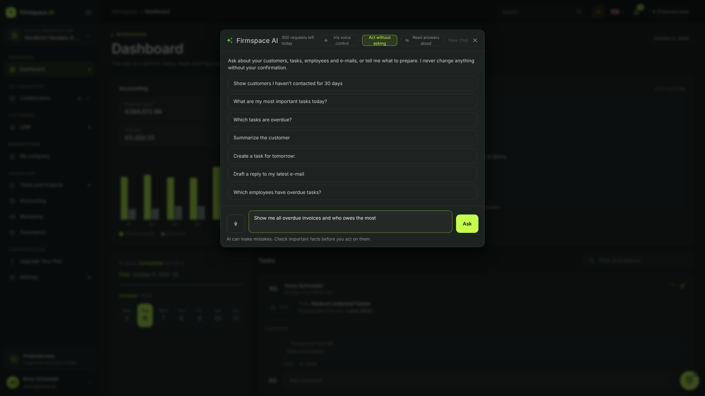

- **Длительность:** 6 с
- **Озвучка (RU):** Firmspace AI — встроенный ассистент Iris. Вызывается по Ctrl/⌘+K: спросите словами, и он найдёт данные, создаст задачу или перенесёт сделку.
- **Подпись на экране (EN):** Ask Iris — your AI assistant
- **Промпт для анимации:** Ctrl+K keycap animation, assistant panel scales in with a soft glow, prompt types in letter by letter, a sparkles icon pulses.

## Header

### 07 · 00:30–00:34 · notifications-bell
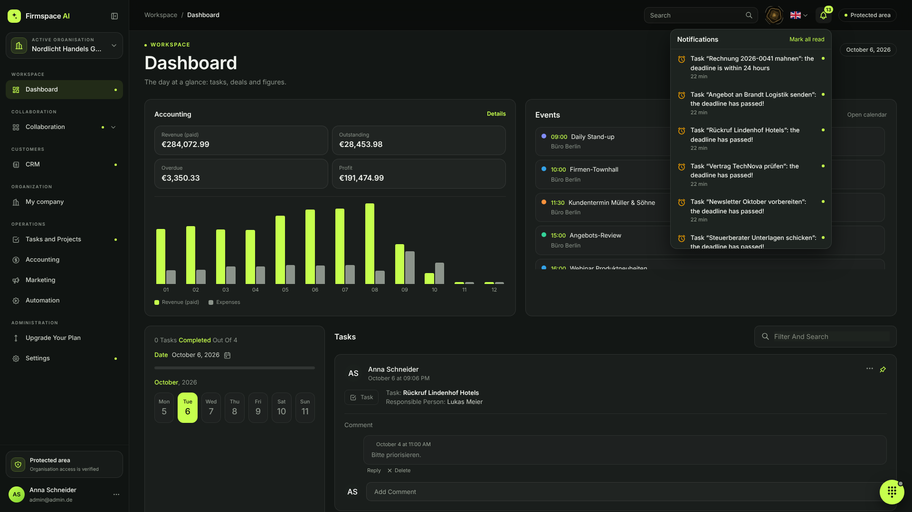

- **Длительность:** 4 с
- **Озвучка (RU):** Уведомления: новые лиды, сообщения, пропущенные звонки, дедлайны и события — ничего не потеряется.
- **Подпись на экране (EN):** Notifications
- **Промпт для анимации:** Bell icon shakes, badge counter pops, dropdown unfolds and notification rows slide in one by one.

### 08 · 00:34–00:38 · language-switch
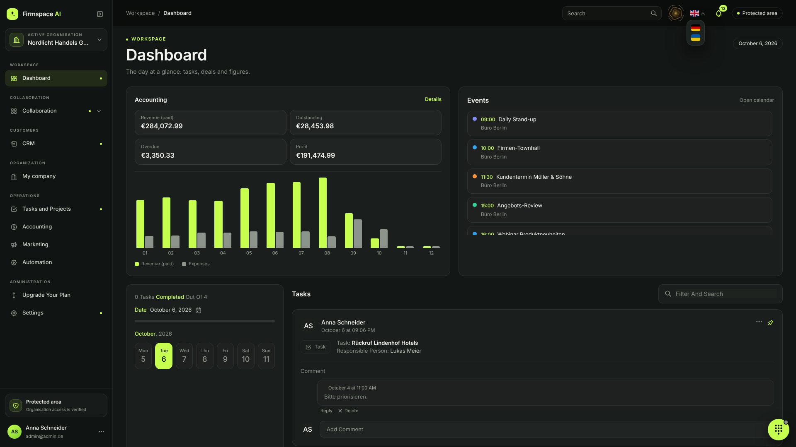

- **Длительность:** 4 с
- **Озвучка (RU):** Интерфейс на нескольких языках: немецкий, английский и украинский — переключение в один клик.
- **Подпись на экране (EN):** Multi-language
- **Промпт для анимации:** Language dropdown opens, flags flip like cards, UI text cross-fades to the selected language.

## Collaboration

### 09 · 00:38–00:43 · feed
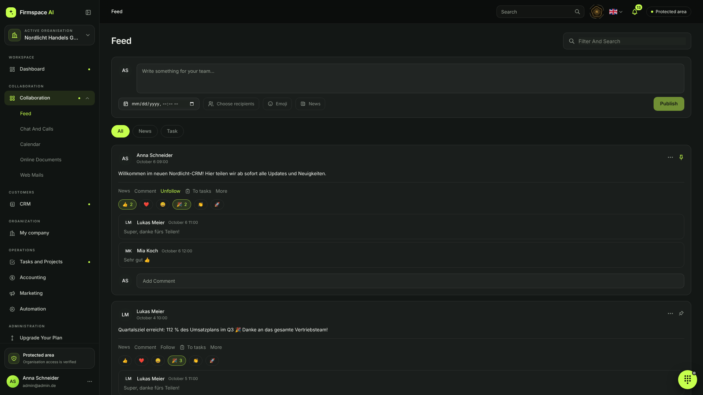

- **Длительность:** 5 с
- **Озвучка (RU):** Лента компании: новости, обсуждения, реакции и комментарии. Важное можно закрепить и адресовать нужным коллегам.
- **Подпись на экране (EN):** Company feed
- **Промпт для анимации:** Feed posts slide in from below one after another with a gentle bounce; emoji reactions pop above the posts with small particle bursts; pinned post gets a lime highlight pulse.

### 10 · 00:43–00:47 · feed-news-filter
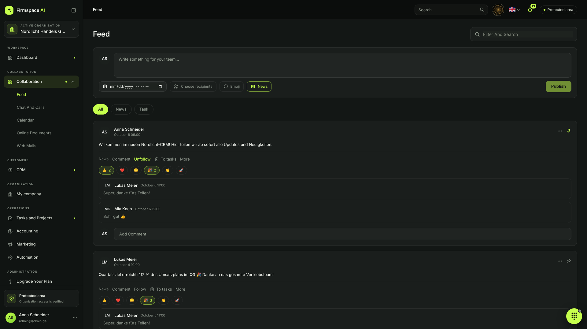

- **Длительность:** 4 с
- **Озвучка (RU):** Фильтр «News» оставляет только официальные объявления — они же попадают на главный экран.
- **Подпись на экране (EN):** News & announcements
- **Промпт для анимации:** Filter chip 'News' lights up lime, non-news posts fade out and the remaining cards re-flow smoothly into place.

### 11 · 00:47–00:53 · chat-inbox
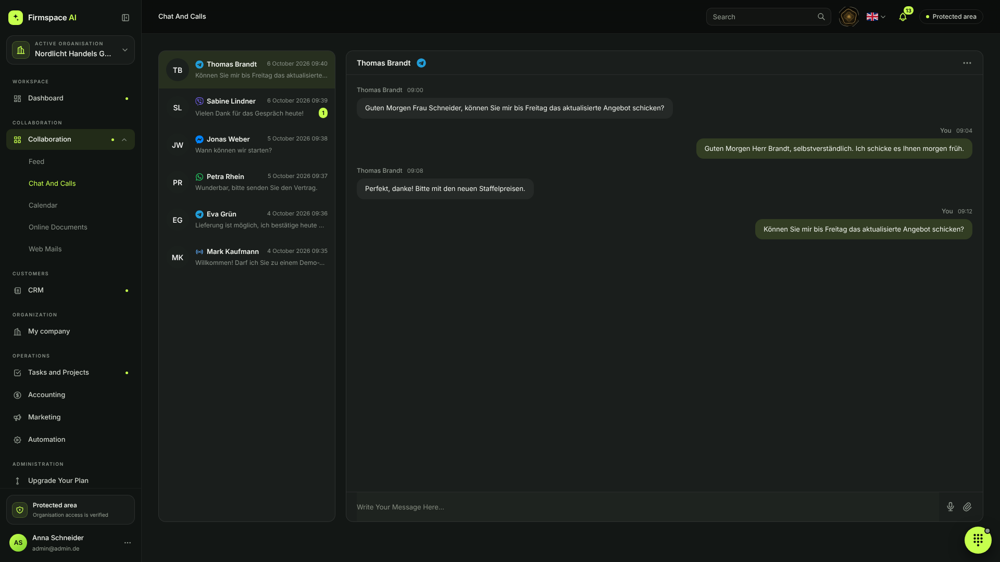

- **Длительность:** 6 с
- **Озвучка (RU):** Единый чат: Telegram, Viber, Messenger, WhatsApp и чат с сайта собраны в одном окне. Непрочитанные подсвечены, диалог привязан к карточке клиента.
- **Подпись на экране (EN):** All messengers in one inbox
- **Промпт для анимации:** Messenger icons (Telegram, Viber, Messenger, WhatsApp) fly in and merge into a single chat list; chat bubbles type in with a typing indicator; unread badge pulses.

### 12 · 00:53–00:58 · chat-conversation
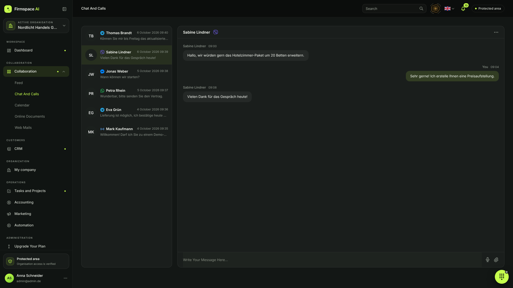

- **Длительность:** 5 с
- **Озвучка (RU):** Открываем диалог и отвечаем клиенту прямо из CRM — текстом, голосом или файлом.
- **Подпись на экране (EN):** Reply from one place
- **Промпт для анимации:** Message bubbles appear sequentially, an outgoing lime bubble slides in from the right with a soft whoosh, microphone and attachment icons gently pulse.

### 13 · 00:58–01:02 · dialer
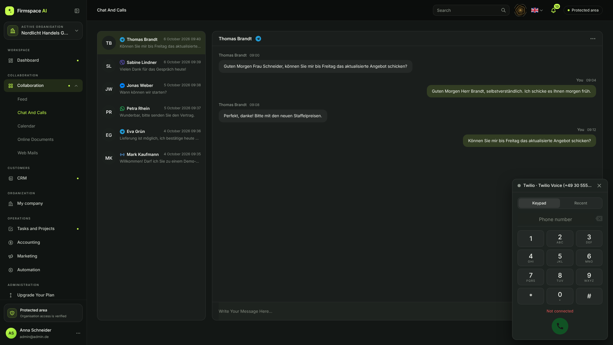

- **Длительность:** 4 с
- **Озвучка (RU):** Встроенный дозвон: звонки клиентам без выхода из CRM, история вызовов сохраняется в карточке.
- **Подпись на экране (EN):** Built-in dialer
- **Промпт для анимации:** Floating lime dial button expands into a dial pad with a smooth scale-up; digits light up one by one as a phone number is entered.

### 14 · 01:02–01:08 · calendar-month
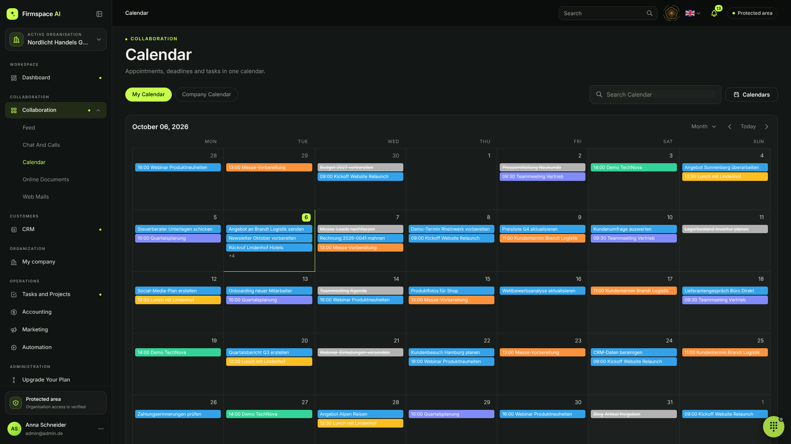

- **Длительность:** 6 с
- **Озвучка (RU):** Календарь объединяет встречи, дедлайны и задачи. Цвет события — тип активности; есть личный и общий календарь компании.
- **Подпись на экране (EN):** Calendar with meetings and deadlines
- **Промпт для анимации:** Calendar grid assembles cell by cell; colored event chips drop into their days with a light bounce; today's cell gets a lime outline pulse.

### 15 · 01:08–01:12 · calendar-company
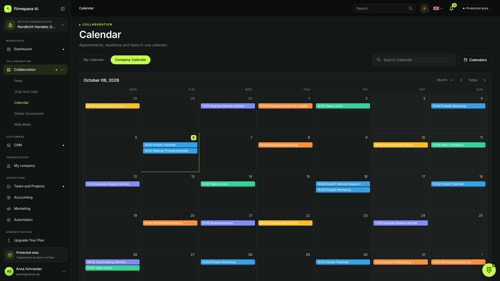

- **Длительность:** 4 с
- **Озвучка (RU):** Переключаемся на общий календарь компании — видно загрузку всей команды.
- **Подпись на экране (EN):** Shared company calendar
- **Промпт для анимации:** Tab highlight slides from 'My Calendar' to 'Company Calendar'; event chips cross-fade into the shared set.

### 16 · 01:12–01:17 · documents
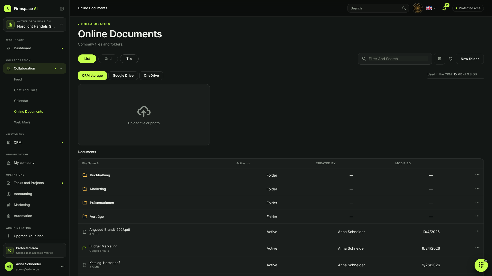

- **Длительность:** 5 с
- **Озвучка (RU):** Онлайн-документы: папки, файлы и Google Docs в одном месте, а ещё подключение Google Drive и OneDrive.
- **Подпись на экране (EN):** Online documents
- **Промпт для анимации:** Folder icons pop in, file rows slide from the left in a stagger; storage usage bar fills smoothly to its value.

### 17 · 01:17–01:21 · documents-grid
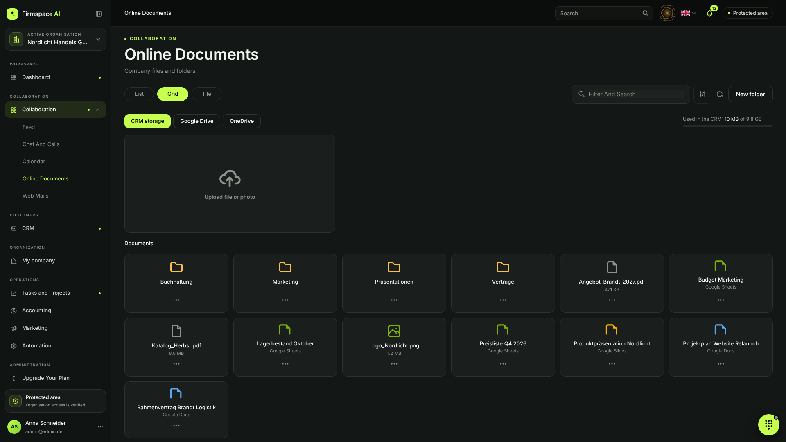

- **Длительность:** 4 с
- **Озвучка (RU):** Режим «Сетка» — удобно просматривать файлы как карточки.
- **Подпись на экране (EN):** Grid view
- **Промпт для анимации:** List rows morph into a card grid with a fluid layout animation, cards scale up slightly one by one.

### 18 · 01:21–01:27 · mail-inbox
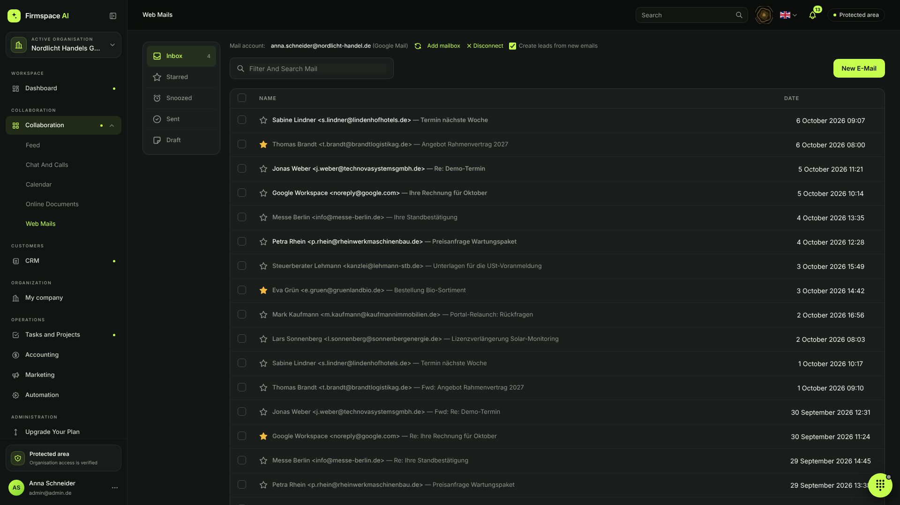

- **Длительность:** 6 с
- **Озвучка (RU):** Веб-почта внутри CRM: Gmail, Outlook, Yahoo, iCloud или любой IMAP. Письма клиентов автоматически превращаются в лиды и ложатся в карточки.
- **Подпись на экране (EN):** Email inside your CRM
- **Промпт для анимации:** Envelope icons fly into the inbox list, unread rows highlight with a lime dot, a star toggles on with a spark.

### 19 · 01:27–01:32 · mail-message
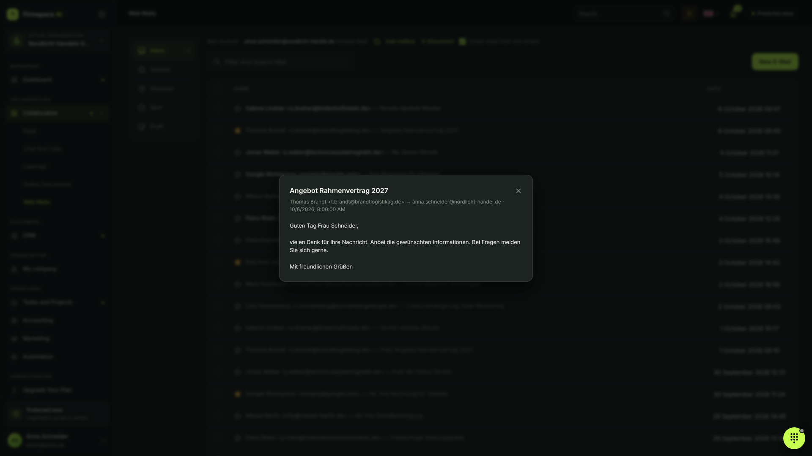

- **Длительность:** 5 с
- **Озвучка (RU):** Открываем письмо и отвечаем, не переключаясь между приложениями.
- **Подпись на экране (EN):** Read and reply
- **Промпт для анимации:** Selected email expands into a reading pane with a smooth slide; text lines reveal progressively; reply button glows.

### 20 · 01:32–01:37 · mail-compose
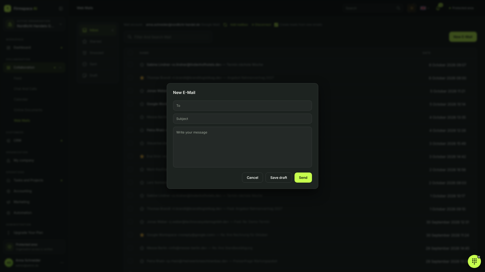

- **Длительность:** 5 с
- **Озвучка (RU):** Новое письмо: адресат, тема, текст — и отправка прямо из CRM, с привязкой к клиенту.
- **Подпись на экране (EN):** Compose an email
- **Промпт для анимации:** Compose window slides up from the bottom, cursor blinks, subject and body type in, send button glows lime.

## CRM

### 21 · 01:37–01:44 · crm-kanban
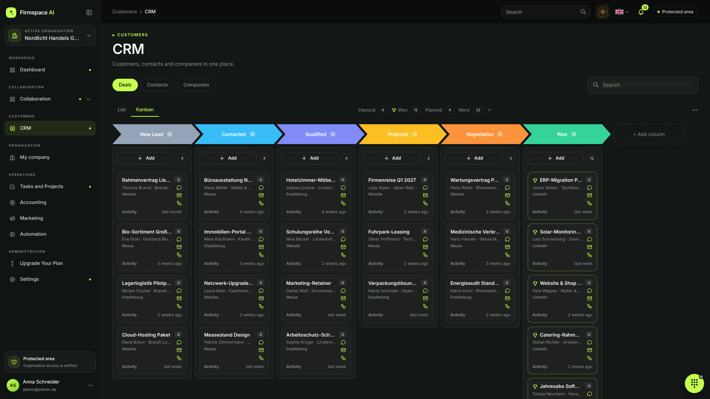

- **Длительность:** 7 с
- **Озвучка (RU):** Воронка продаж в формате канбан: от нового лида до выигранной сделки. Карточки перетаскиваются между этапами.
- **Подпись на экране (EN):** Sales pipeline
- **Промпт для анимации:** Columns build from left to right with a chevron wipe; a deal card lifts, drags across to the next stage with a motion trail and drops with a subtle settle.

### 22 · 01:44–01:49 · crm-list
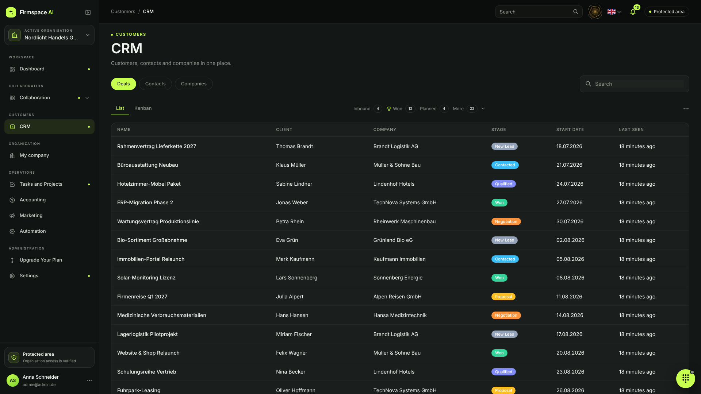

- **Длительность:** 5 с
- **Озвучка (RU):** Те же сделки списком — с сортировкой, фильтрами и массовыми действиями.
- **Подпись на экране (EN):** List view
- **Промпт для анимации:** Kanban columns collapse into table rows with a fluid morph; header columns slide in and rows stagger-fade.

### 23 · 01:49–01:55 · crm-deal-card
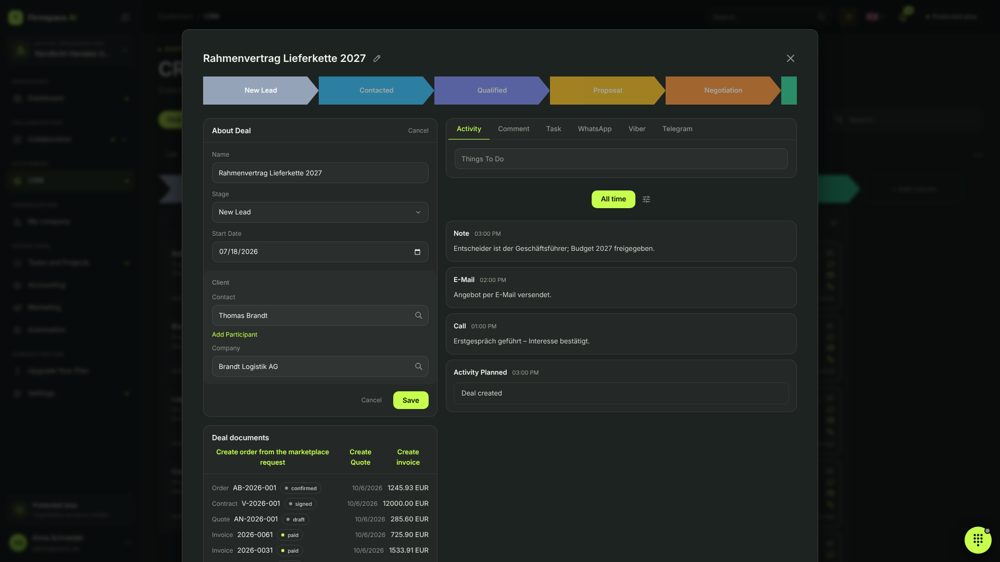

- **Длительность:** 6 с
- **Озвучка (RU):** Карточка сделки: клиент, ответственный, сумма, история активностей — звонки, письма, заметки и задачи в одной ленте.
- **Подпись на экране (EN):** Deal details & activity timeline
- **Промпт для анимации:** Deal card opens as a side panel with a smooth slide-in; timeline entries (call, email, note) appear top to bottom with connecting line drawing between them.

### 24 · 01:55–02:00 · crm-add-deal
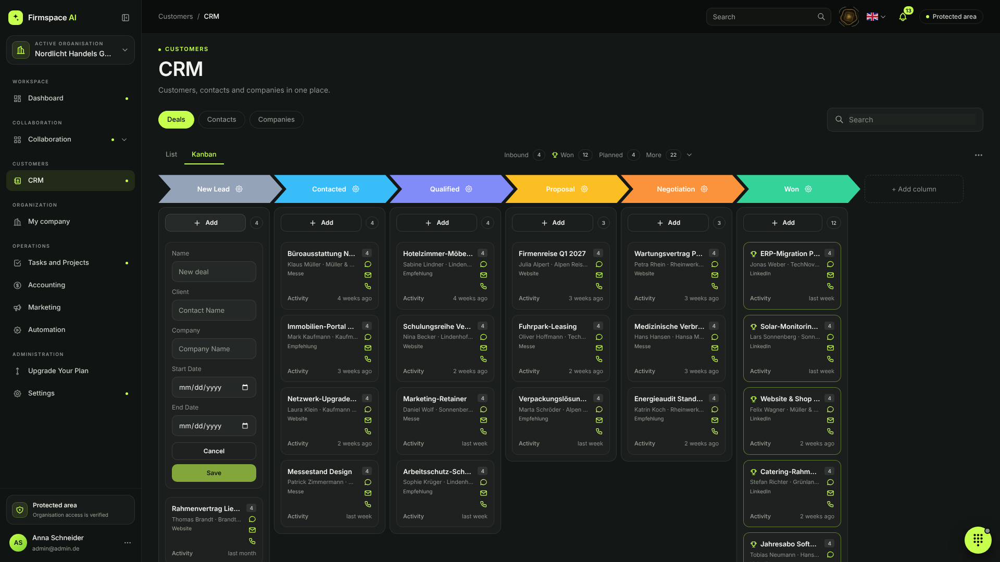

- **Длительность:** 5 с
- **Озвучка (RU):** Создать сделку можно в один клик прямо в нужной колонке.
- **Подпись на экране (EN):** Create a deal in one click
- **Промпт для анимации:** Plus button pulses, a modal scales up from the button with blurred backdrop, form fields fill themselves with typing animation.

### 25 · 02:00–02:06 · crm-contacts
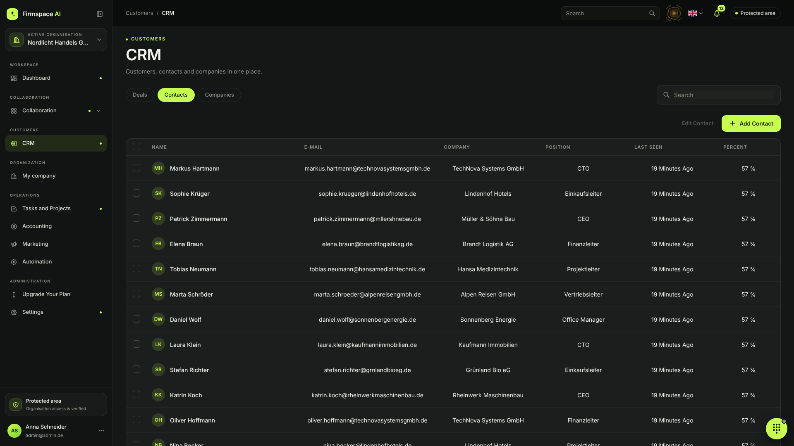

- **Длительность:** 6 с
- **Озвучка (RU):** База контактов: должности, компании, источники и заметки. Поиск и фильтры по любому полю.
- **Подпись на экране (EN):** Contacts database
- **Промпт для анимации:** Table rows cascade in with avatars popping; search field expands and filters rows with a quick shuffle.

### 26 · 02:06–02:12 · crm-contact-card
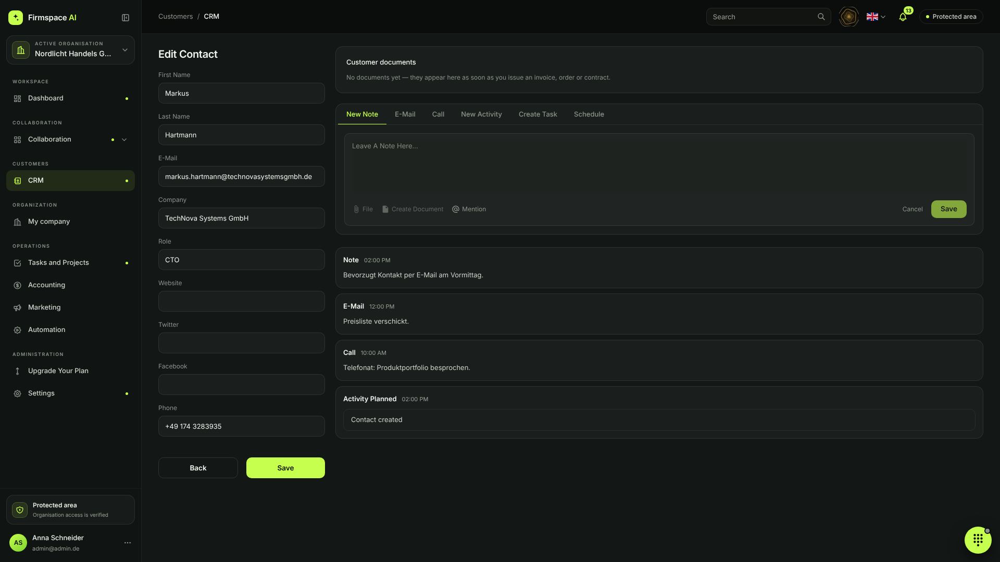

- **Длительность:** 6 с
- **Озвучка (RU):** Карточка контакта: вся переписка, звонки и сделки клиента — полная история отношений.
- **Подпись на экране (EN):** 360° customer card
- **Промпт для анимации:** Profile header fades in with avatar scale, tabs underline slides, activity feed items appear one by one with soft glow.

### 27 · 02:12–02:17 · crm-companies
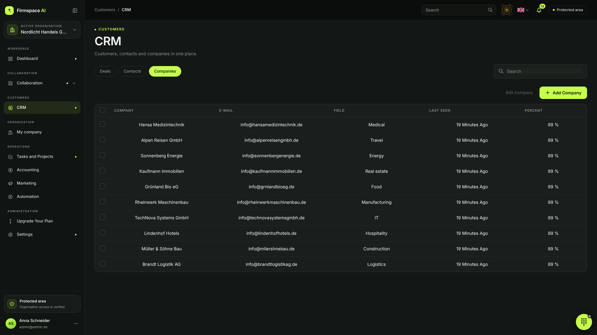

- **Длительность:** 5 с
- **Озвучка (RU):** Компании-клиенты: реквизиты, кредитный лимит, условия оплаты и все связанные контакты.
- **Подпись на экране (EN):** Companies
- **Промпт для анимации:** Company cards flip in sequentially, credit-limit meters fill, tags fade in.

### 28 · 02:17–02:22 · crm-company-card
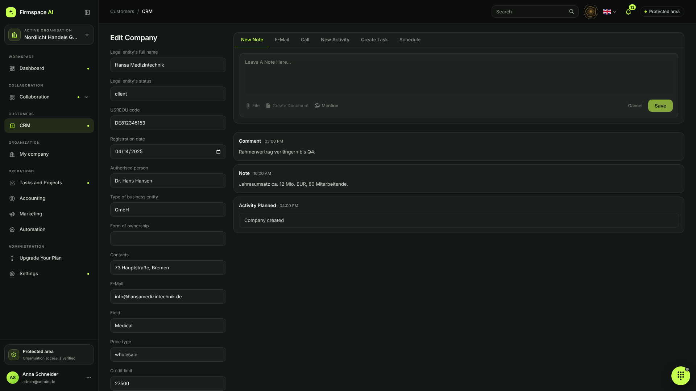

- **Длительность:** 5 с
- **Озвучка (RU):** Карточка компании: данные, сотрудники клиента, договоры и счета.
- **Подпись на экране (EN):** Company profile
- **Промпт для анимации:** Company header and details panels slide in from opposite sides and snap into place; linked records chips pop in.

## My company

### 29 · 02:22–02:27 · company-employees
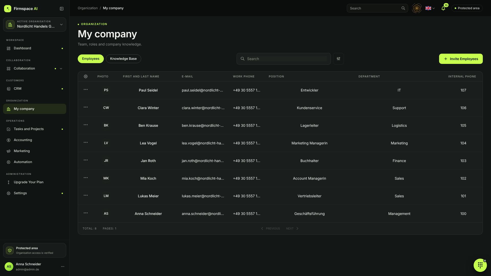

- **Длительность:** 5 с
- **Озвучка (RU):** Раздел «Моя компания»: сотрудники, должности, отделы и внутренние номера.
- **Подпись на экране (EN):** Team directory
- **Промпт для анимации:** Employee rows stagger in, avatars initial circles pop, hover highlight sweeps down the table.

### 30 · 02:27–02:31 · company-invite
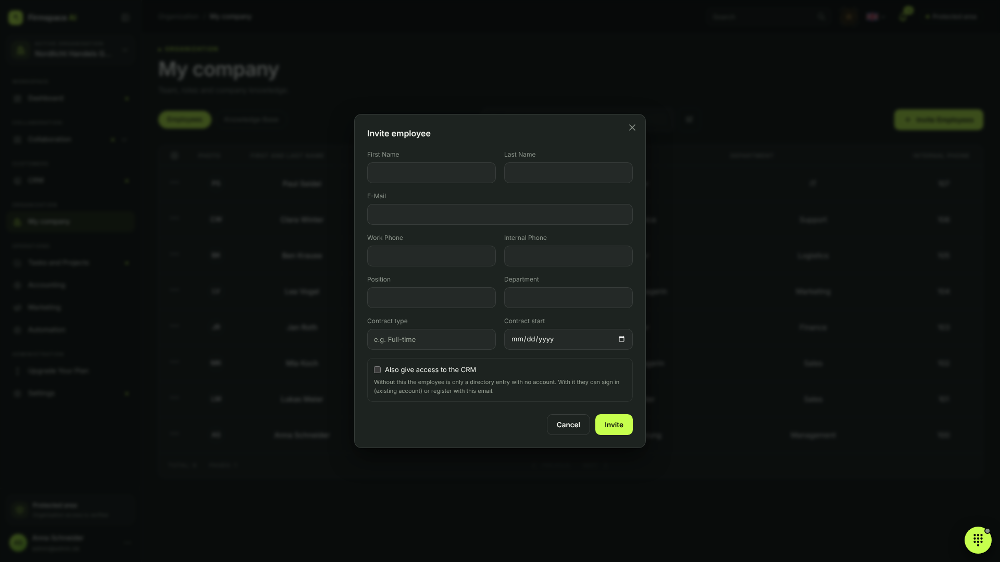

- **Длительность:** 4 с
- **Озвучка (RU):** Приглашаем нового сотрудника по e-mail и сразу задаём роль и доступ к разделам.
- **Подпись на экране (EN):** Invite your team
- **Промпт для анимации:** Invite button glows, modal scales up, email field types in an address, role dropdown opens.

### 31 · 02:31–02:36 · company-knowledge
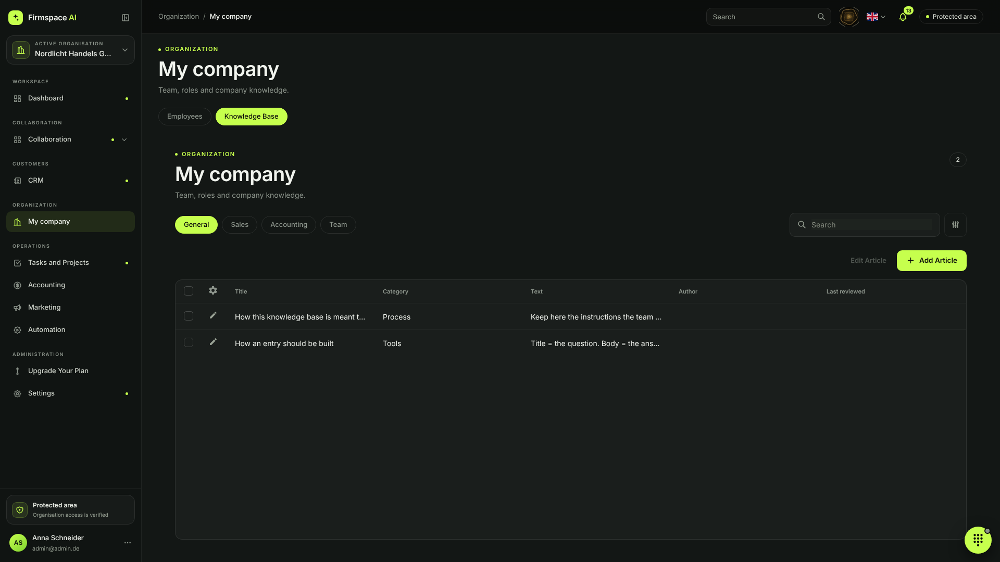

- **Длительность:** 5 с
- **Озвучка (RU):** База знаний: регламенты, скрипты продаж и инструкции по темам — новичок быстро входит в курс дела.
- **Подпись на экране (EN):** Knowledge base
- **Промпт для анимации:** Knowledge article cards fan out like a deck then settle into a grid; category tabs underline slides.

## Tasks & projects

### 32 · 02:36–02:42 · tasks-list
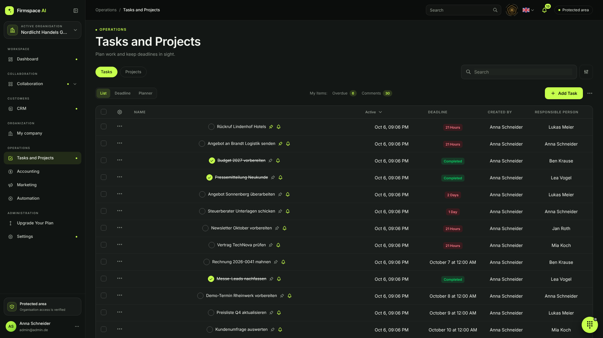

- **Длительность:** 6 с
- **Озвучка (RU):** Задачи и проекты: список с дедлайнами, ответственными и статусом. Просроченное подсвечено красным.
- **Подпись на экране (EN):** Tasks
- **Промпт для анимации:** Task rows slide in, checkboxes tick with a lime check animation, overdue badges flash red once.

### 33 · 02:42–02:46 · tasks-deadline
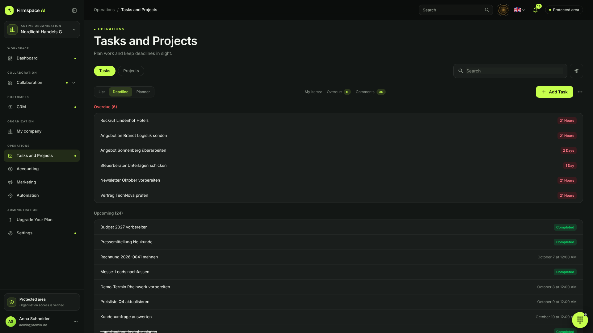

- **Длительность:** 4 с
- **Озвучка (RU):** Режим «Дедлайн» — задачи, сгруппированные по срокам.
- **Подпись на экране (EN):** Group by deadline
- **Промпт для анимации:** Rows regroup into time buckets (today, tomorrow, later) with fluid reordering motion.

### 34 · 02:46–02:51 · tasks-planner
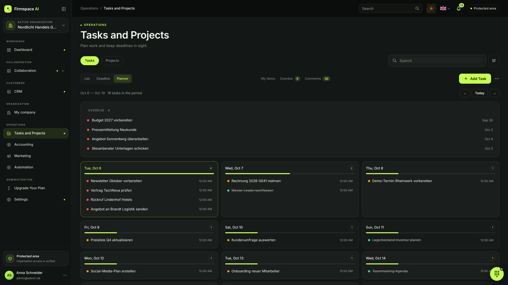

- **Длительность:** 5 с
- **Озвучка (RU):** Планировщик показывает загрузку по дням — удобно распределять работу.
- **Подпись на экране (EN):** Planner
- **Промпт для анимации:** Week columns appear, task chips drop into days and resize to their durations.

### 35 · 02:51–02:56 · tasks-add
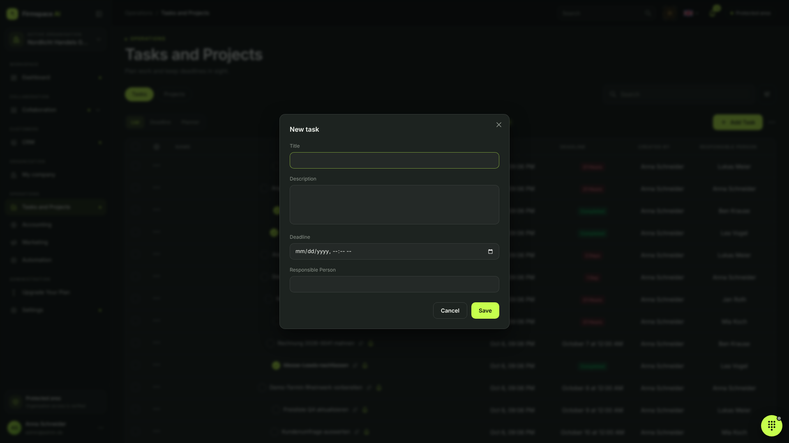

- **Длительность:** 5 с
- **Озвучка (RU):** Новая задача создаётся за секунды: название, срок, ответственный, привязка к сделке или проекту.
- **Подпись на экране (EN):** Create a task
- **Промпт для анимации:** Add Task button pulses, modal rises with blur, fields autofill with typing animation, create button glows.

### 36 · 02:56–03:01 · projects
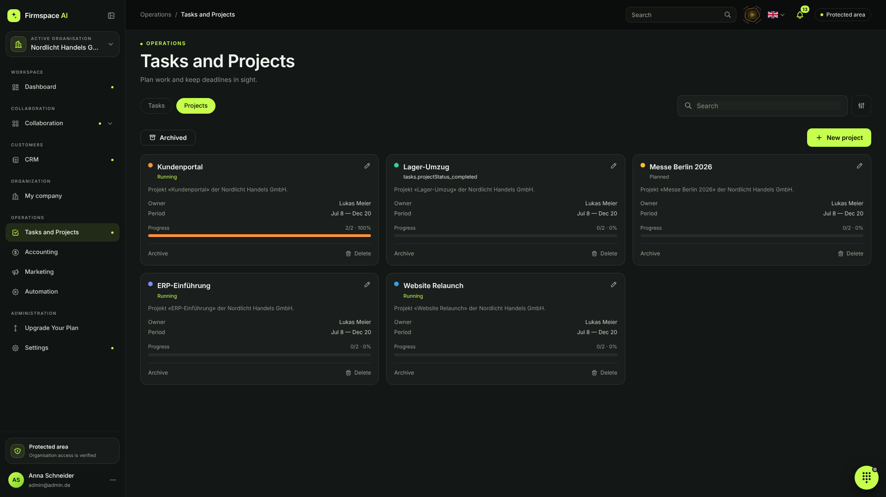

- **Длительность:** 5 с
- **Озвучка (RU):** Проекты со статусом, цветом и сроками. Задачи привязываются к проекту.
- **Подпись на экране (EN):** Projects
- **Промпт для анимации:** Project cards in different accent colors slide in with progress bars filling.

## Accounting

### 37 · 03:01–03:08 · accounting-overview
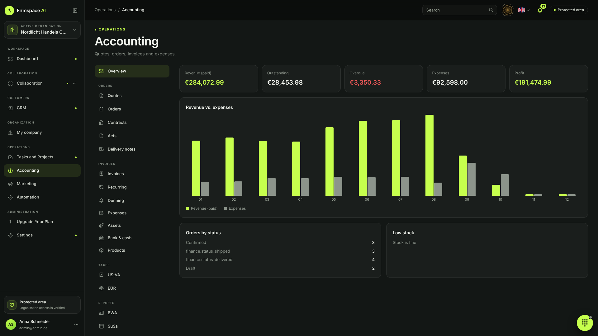

- **Длительность:** 7 с
- **Озвучка (RU):** Бухгалтерия: выручка, неоплаченные и просроченные счета, расходы и прибыль — на одном экране, с графиком по месяцам.
- **Подпись на экране (EN):** Real-time finance overview
- **Промпт для анимации:** KPI numbers count up from zero; bar chart columns grow upward in a wave from January to October; profit figure glows lime.

### 38 · 03:08–03:14 · accounting-invoices
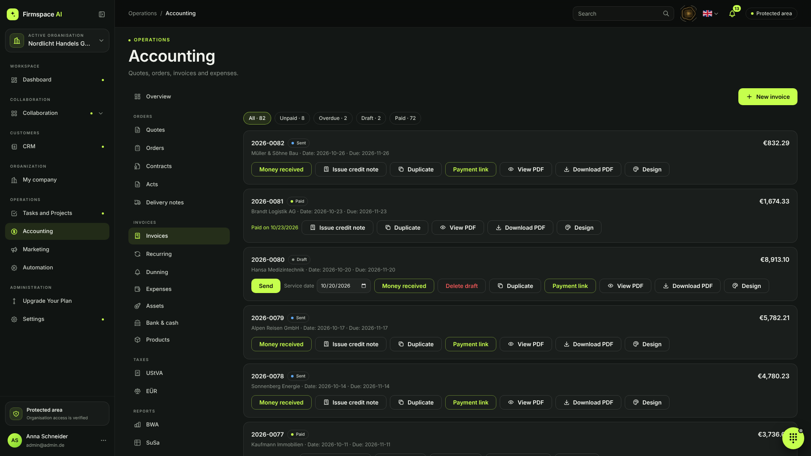

- **Длительность:** 6 с
- **Озвучка (RU):** Счета: статусы «оплачен», «отправлен», «просрочен», PDF в один клик и автоматические напоминания.
- **Подпись на экране (EN):** Invoices
- **Промпт для анимации:** Invoice rows stagger in with status pills changing color (draft, sent, paid, overdue); a PDF icon flips out of a row.

### 39 · 03:14–03:18 · accounting-quotes
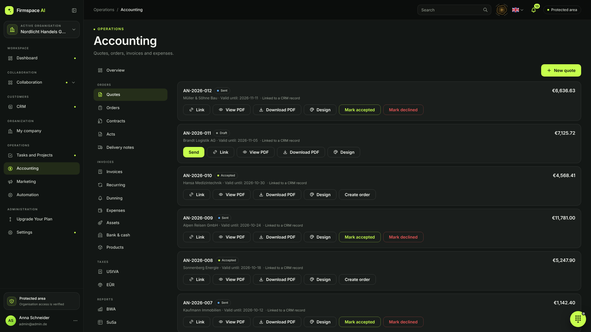

- **Длительность:** 4 с
- **Озвучка (RU):** Коммерческие предложения с версиями и сроком действия — принятое превращается в заказ.
- **Подпись на экране (EN):** Quotes
- **Промпт для анимации:** Quote card flips and converts into an order card with a lime arrow transition.

### 40 · 03:18–03:22 · accounting-orders
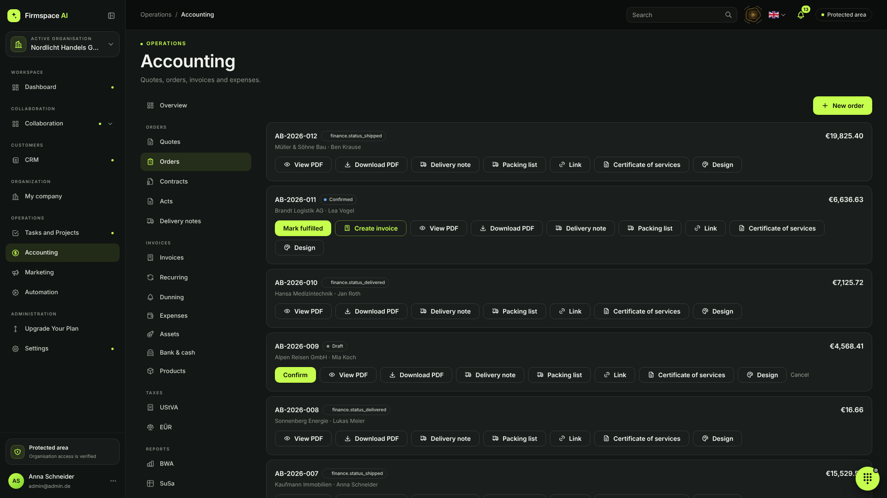

- **Длительность:** 4 с
- **Озвучка (RU):** Заказы с накладными и статусами доставки.
- **Подпись на экране (EN):** Orders
- **Промпт для анимации:** Order status chips progress from Confirmed to Shipped to Delivered with a moving highlight.

### 41 · 03:22–03:26 · accounting-contracts
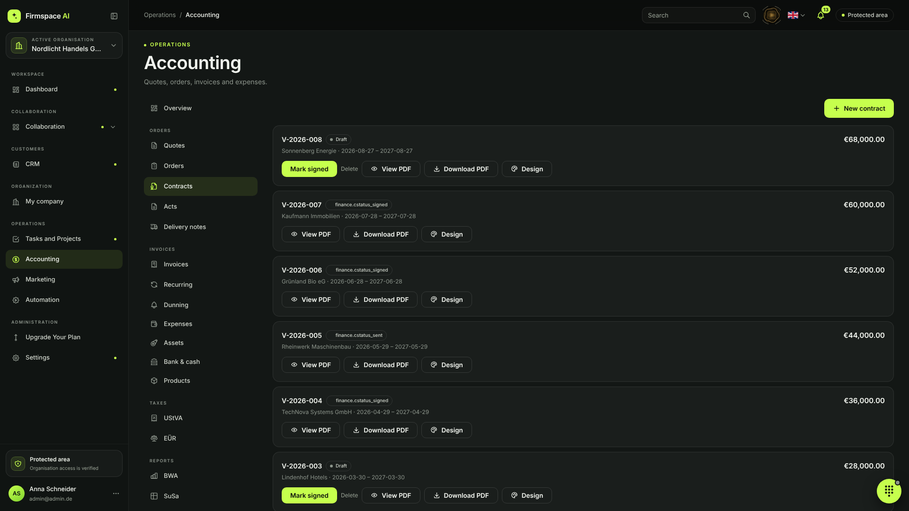

- **Длительность:** 4 с
- **Озвучка (RU):** Договоры: суммы, сроки и статус подписания.
- **Подпись на экране (EN):** Contracts
- **Промпт для анимации:** Contract rows fade in, a signature stroke draws on a 'signed' row.

### 42 · 03:26–03:30 · accounting-recurring
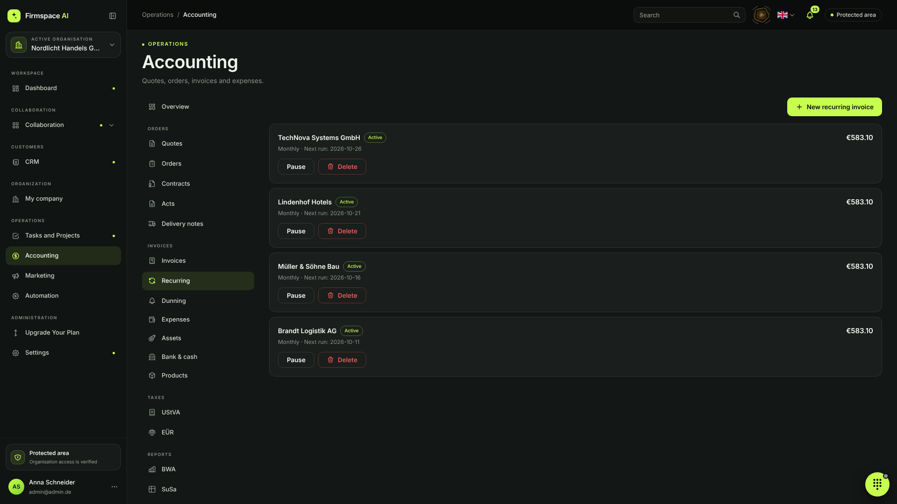

- **Длительность:** 4 с
- **Озвучка (RU):** Регулярные счета выставляются сами по расписанию.
- **Подпись на экране (EN):** Recurring invoices
- **Промпт для анимации:** A circular arrow loops around invoice rows; next-run dates tick forward.

### 43 · 03:30–03:34 · accounting-dunning
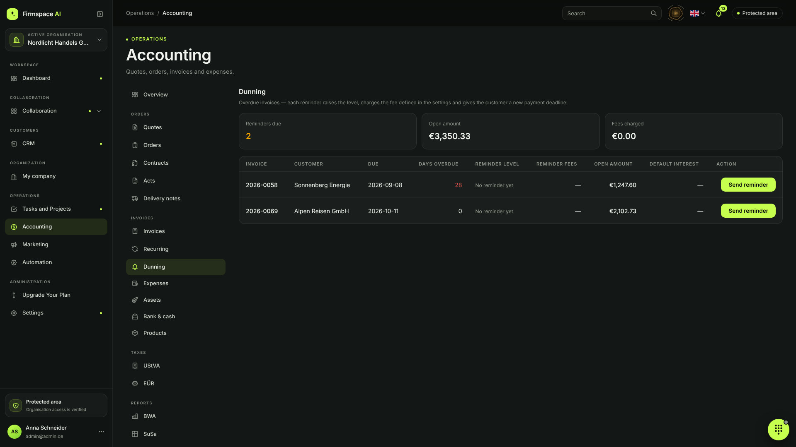

- **Длительность:** 4 с
- **Озвучка (RU):** Автоматические напоминания и уровни Mahnung — деньги возвращаются быстрее.
- **Подпись на экране (EN):** Dunning
- **Промпт для анимации:** Escalation steps light up level by level from friendly reminder to final notice.

### 44 · 03:34–03:39 · accounting-expenses
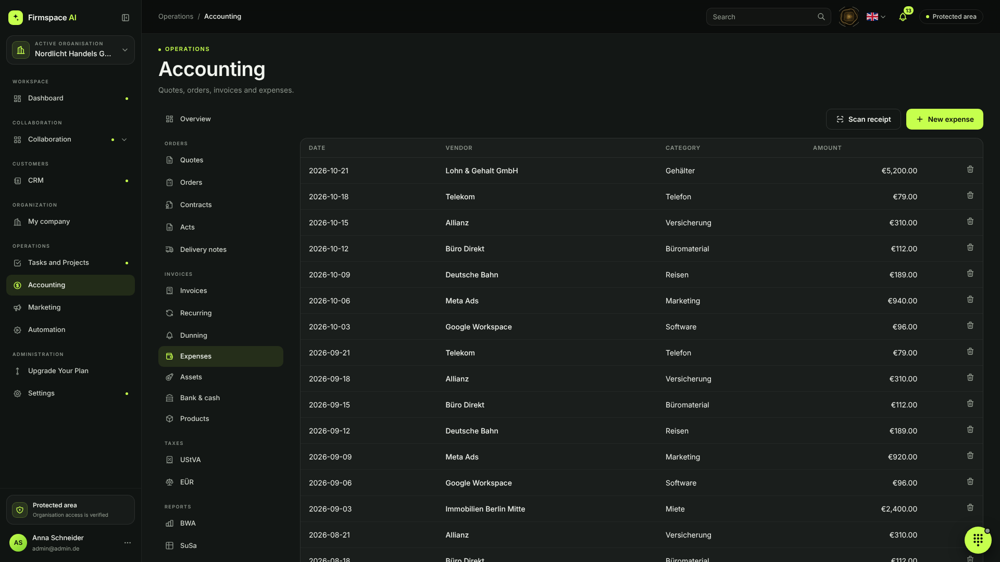

- **Длительность:** 5 с
- **Озвучка (RU):** Расходы по категориям: аренда, ПО, реклама, зарплаты. Видно, куда уходят деньги.
- **Подпись на экране (EN):** Expenses
- **Промпт для анимации:** Expense rows slide in, category tags color-code, totals tick up at the bottom.

### 45 · 03:39–03:43 · accounting-assets
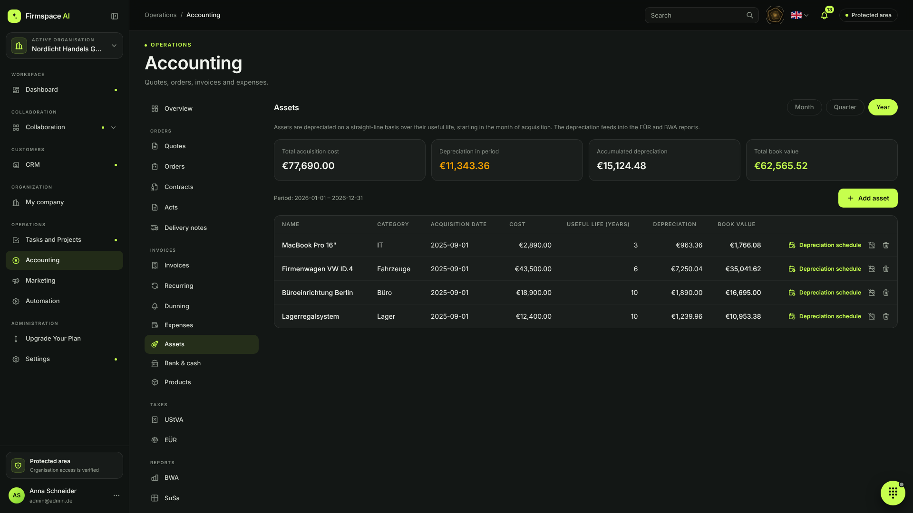

- **Длительность:** 4 с
- **Озвучка (RU):** Основные средства и амортизация считаются автоматически.
- **Подпись на экране (EN):** Fixed assets
- **Промпт для анимации:** Asset cards appear and a depreciation curve draws downward.

### 46 · 03:43–03:49 · accounting-bank
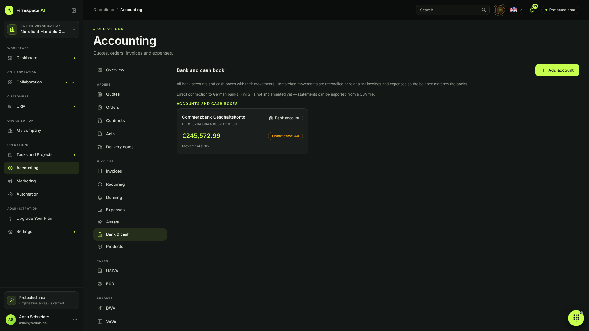

- **Длительность:** 6 с
- **Озвучка (RU):** Банк и касса: выписки сопоставляются со счетами — оплаты закрываются автоматически.
- **Подпись на экране (EN):** Bank reconciliation
- **Промпт для анимации:** Bank transactions on the left snap to matching invoices on the right with glowing connector lines.

### 47 · 03:49–03:54 · accounting-products
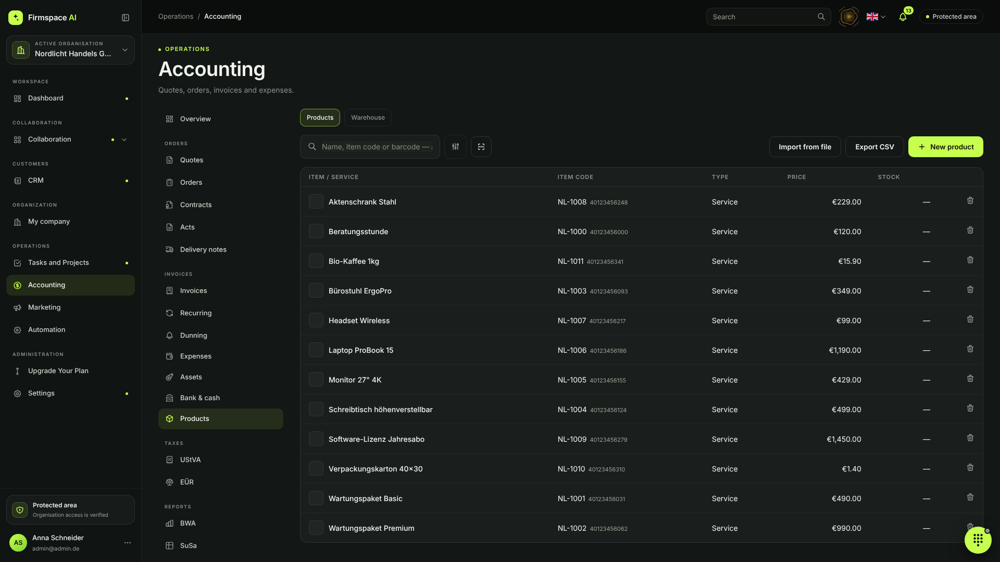

- **Длительность:** 5 с
- **Озвучка (RU):** Каталог товаров и услуг: цены, налоги и складские остатки.
- **Подпись на экране (EN):** Products & stock
- **Промпт для анимации:** Product tiles pop in, stock level bars fill, a low-stock indicator pulses amber.

### 48 · 03:54–03:59 · accounting-ustva
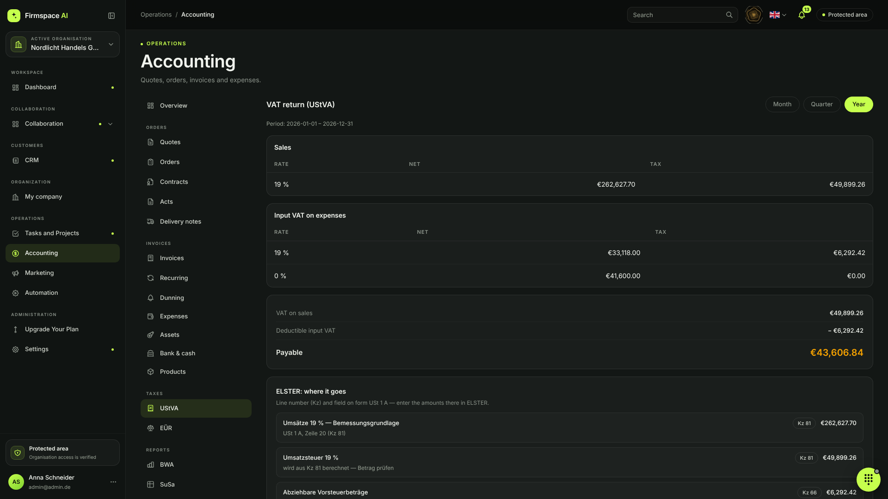

- **Длительность:** 5 с
- **Озвучка (RU):** Налоговая отчётность Германии: UStVA формируется из ваших данных.
- **Подпись на экране (EN):** German VAT return
- **Промпт для анимации:** Tax form fields fill in automatically one after another, totals highlight in lime.

### 49 · 03:59–04:04 · accounting-bwa
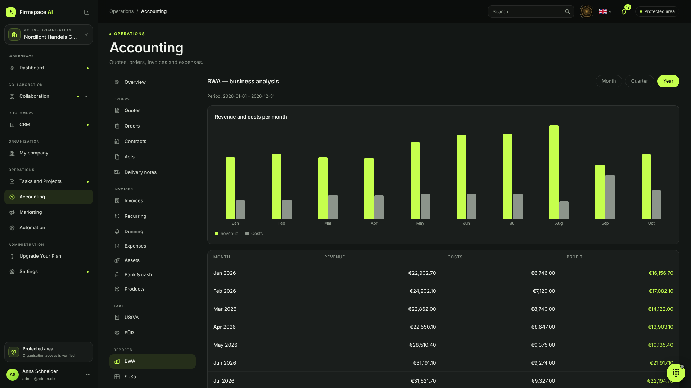

- **Длительность:** 5 с
- **Озвучка (RU):** Отчёты BWA и SuSa — для бухгалтера и налоговой в пару кликов.
- **Подпись на экране (EN):** Financial reports
- **Промпт для анимации:** Report table builds row by row, subtotal rows highlight, a chart sparkline draws in the margin.

## Marketing

### 50 · 04:04–04:09 · marketing-start
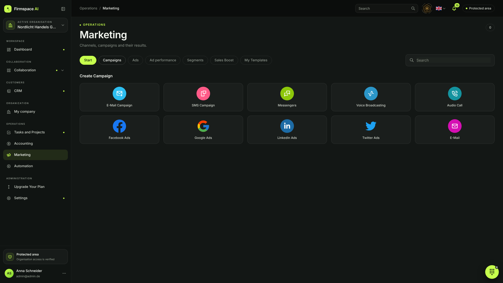

- **Длительность:** 5 с
- **Озвучка (RU):** Маркетинг: e-mail, SMS, мессенджеры, голосовые рассылки и реклама Facebook, Google, LinkedIn — запуск кампании с одной страницы.
- **Подпись на экране (EN):** Launch campaigns in every channel
- **Промпт для анимации:** Channel tiles pop in with icons bouncing, hover glow travels across the grid.

### 51 · 04:09–04:14 · marketing-campaigns
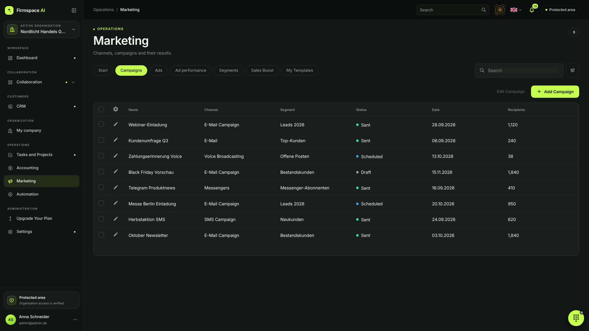

- **Длительность:** 5 с
- **Озвучка (RU):** Кампании со статусом, сегментом и числом получателей.
- **Подпись на экране (EN):** Campaigns
- **Промпт для анимации:** Campaign rows slide in, status pills (draft, scheduled, sent) colorize, recipient counts tick up.

### 52 · 04:14–04:19 · marketing-ads
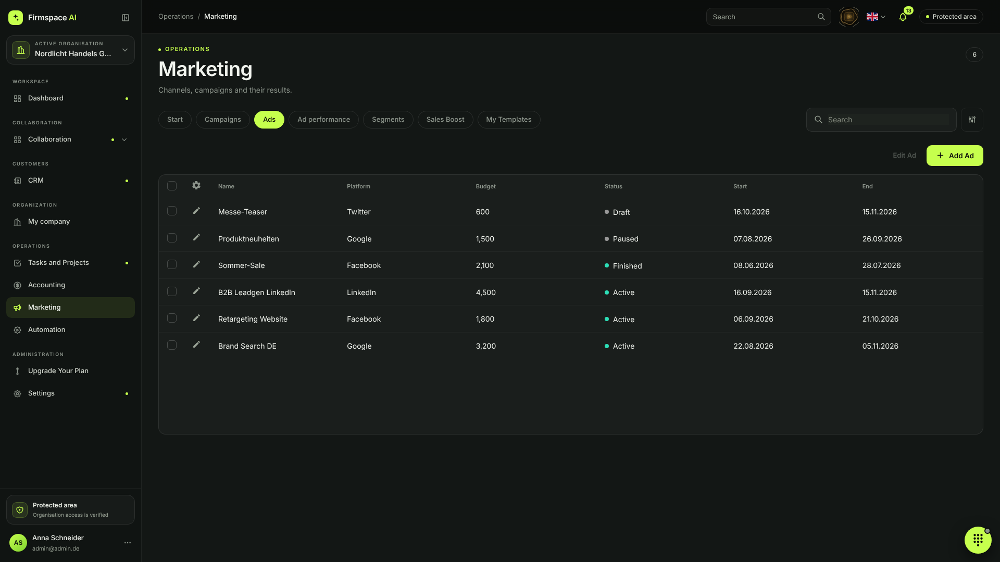

- **Длительность:** 5 с
- **Озвучка (RU):** Рекламные объявления и бюджеты по платформам.
- **Подпись на экране (EN):** Ads
- **Промпт для анимации:** Platform logos fade in per row, budget bars fill proportionally.

### 53 · 04:19–04:23 · marketing-segments
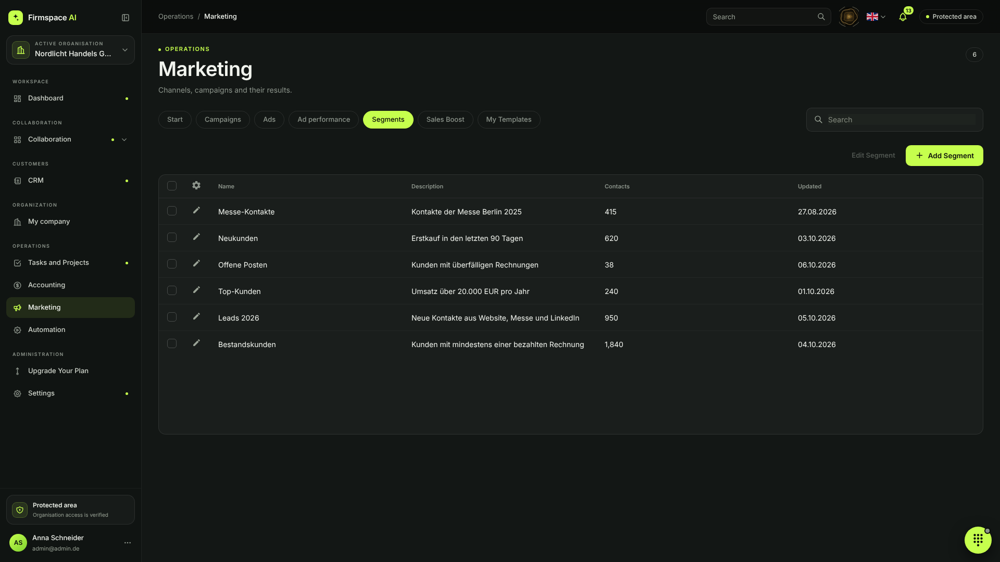

- **Длительность:** 4 с
- **Озвучка (RU):** Сегменты аудитории для точных рассылок.
- **Подпись на экране (EN):** Audience segments
- **Промпт для анимации:** Bubbles of different sizes (segments) float in and settle, sizes reflect contact counts.

### 54 · 04:23–04:27 · marketing-boost
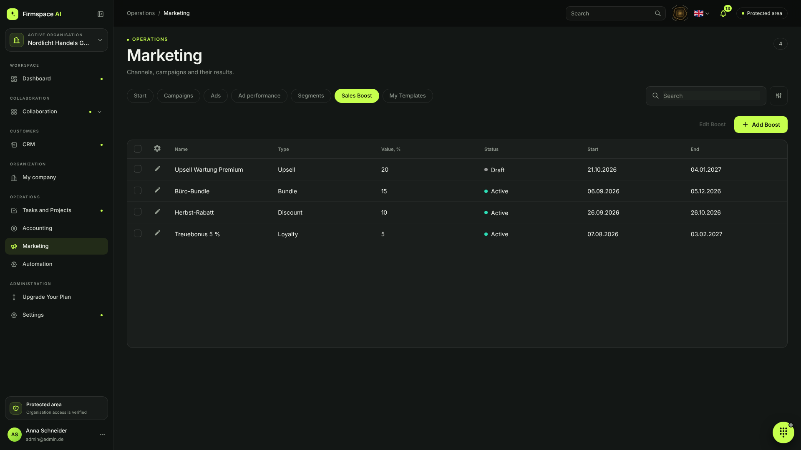

- **Длительность:** 4 с
- **Озвучка (RU):** Sales Boost — акции, бандлы и программы лояльности.
- **Подпись на экране (EN):** Sales boost
- **Промпт для анимации:** Promo badges (percent, bundle, loyalty) burst in with light confetti sparks.

### 55 · 04:27–04:31 · marketing-templates
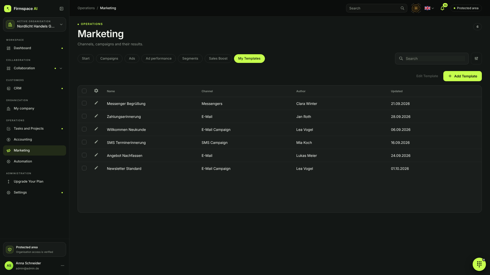

- **Длительность:** 4 с
- **Озвучка (RU):** Шаблоны писем и сообщений — один раз написали, используете везде.
- **Подпись на экране (EN):** Templates
- **Промпт для анимации:** Template cards stack and fan out, a text preview types into one card.

## Automation

### 56 · 04:31–04:37 · automation-rules
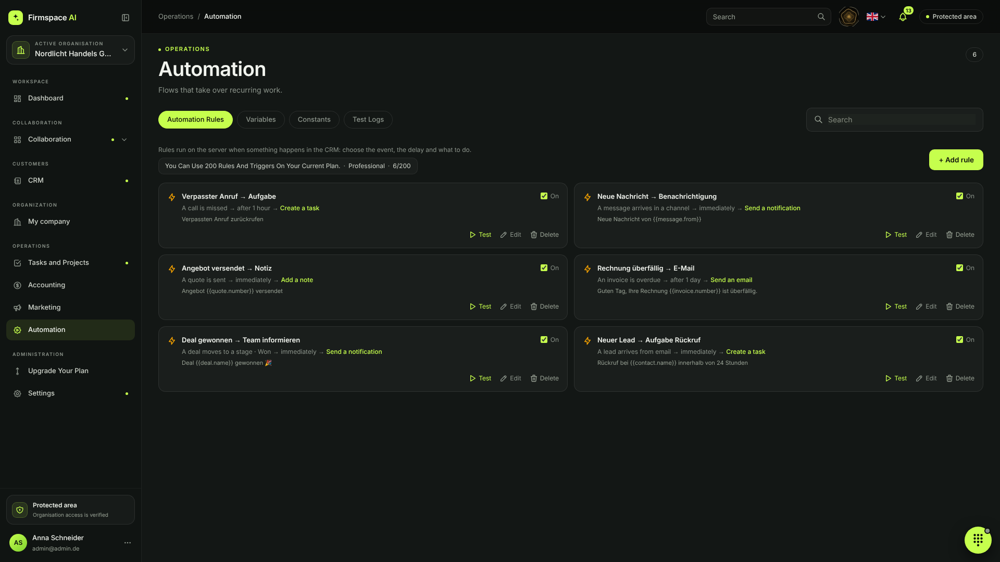

- **Длительность:** 6 с
- **Озвучка (RU):** Автоматизация: «если случилось событие — выполни действие». Новый лид — создать задачу, сделка выиграна — уведомить команду, счёт просрочен — отправить письмо.
- **Подпись на экране (EN):** No-code automation rules
- **Промпт для анимации:** Rule cards appear; a glowing line connects trigger → delay → action nodes in sequence, pulses travel along the line.

### 57 · 04:37–04:42 · automation-add-rule
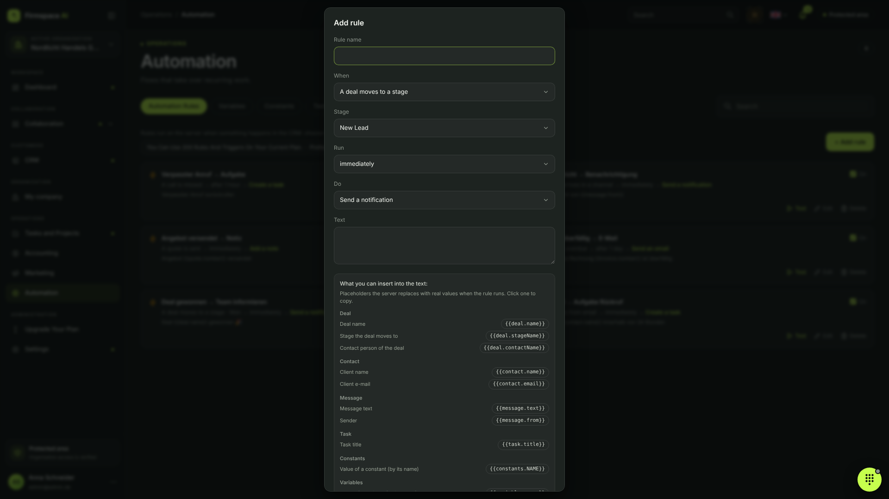

- **Длительность:** 5 с
- **Озвучка (RU):** Правило собирается за минуту: событие, задержка, действие и текст с переменными.
- **Подпись на экране (EN):** Build a rule in a minute
- **Промпт для анимации:** Rule builder modal opens; dropdowns for event, timing and action fill in sequentially, variable chips snap into the message field.

### 58 · 04:42–04:46 · automation-variables
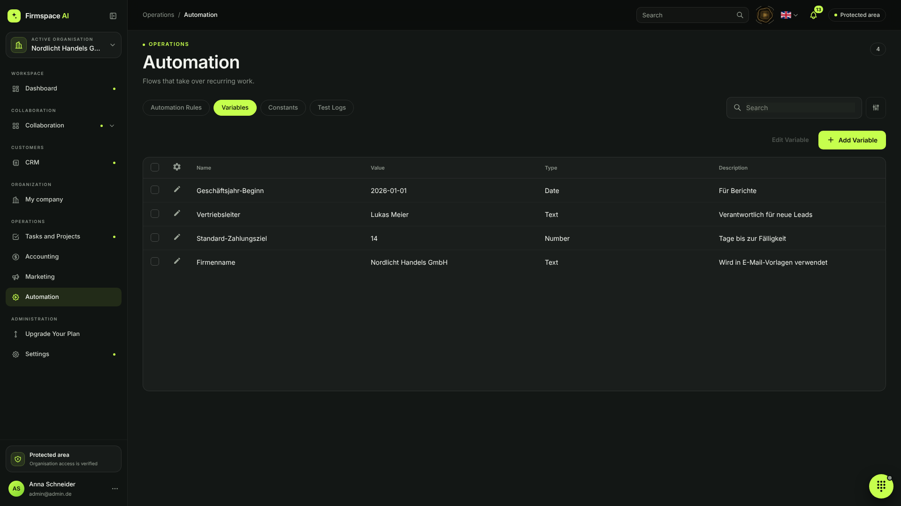

- **Длительность:** 4 с
- **Озвучка (RU):** Переменные и константы подставляются в тексты автоматически.
- **Подпись на экране (EN):** Variables & constants
- **Промпт для анимации:** Curly-brace tokens {{name}} morph into real values in a sample message.

### 59 · 04:46–04:50 · automation-logs
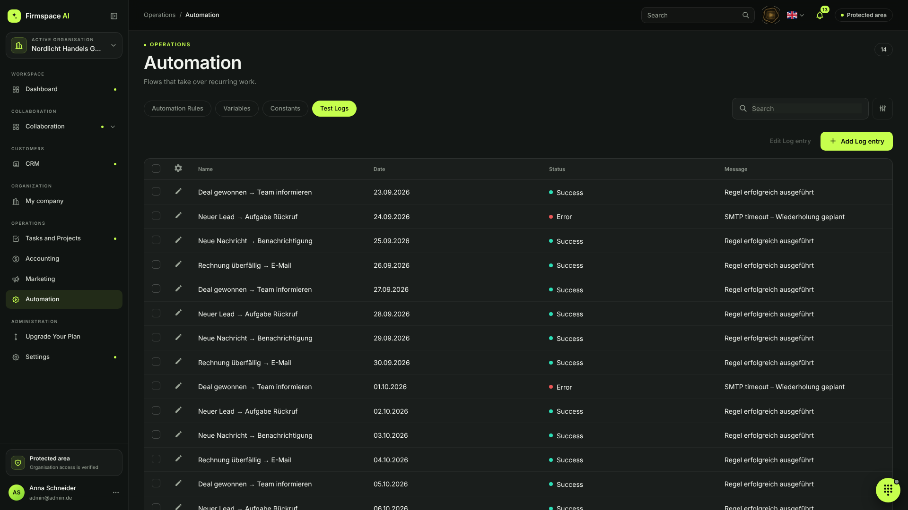

- **Длительность:** 4 с
- **Озвучка (RU):** Журнал запусков показывает, какие правила сработали и чем закончились.
- **Подпись на экране (EN):** Run history
- **Промпт для анимации:** Log rows stream in from the top, success rows glow green, an error row flashes red once.

## Plans

### 60 · 04:50–04:55 · upgrade-plans
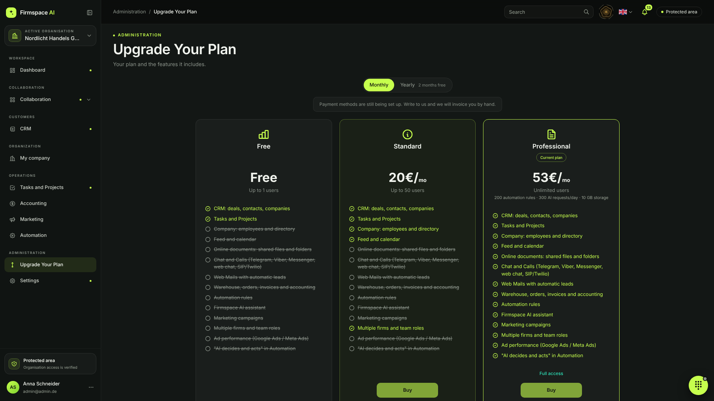

- **Длительность:** 5 с
- **Озвучка (RU):** Тарифы: Free, Standard и Professional — от личной воронки до полной платформы без ограничений.
- **Подпись на экране (EN):** Simple plans
- **Промпт для анимации:** Three pricing cards rise in sequence, the highlighted middle card lifts and glows lime.

## Settings

### 61 · 04:55–04:59 · settings-account
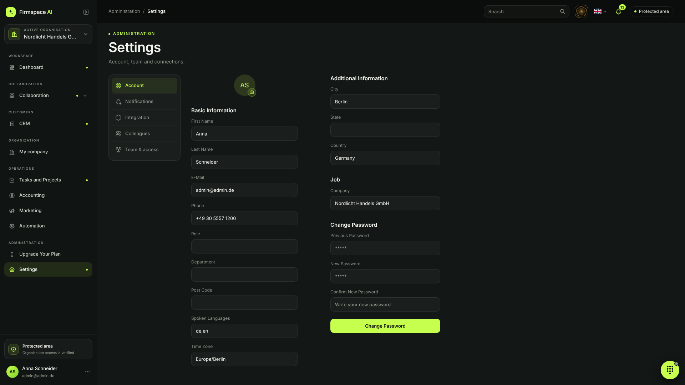

- **Длительность:** 4 с
- **Озвучка (RU):** Настройки профиля: данные, фото, язык и пароль.
- **Подпись на экране (EN):** Account settings
- **Промпт для анимации:** Profile form fields fade in, avatar circle scales up with a soft ring pulse.

### 62 · 04:59–05:03 · settings-notifications
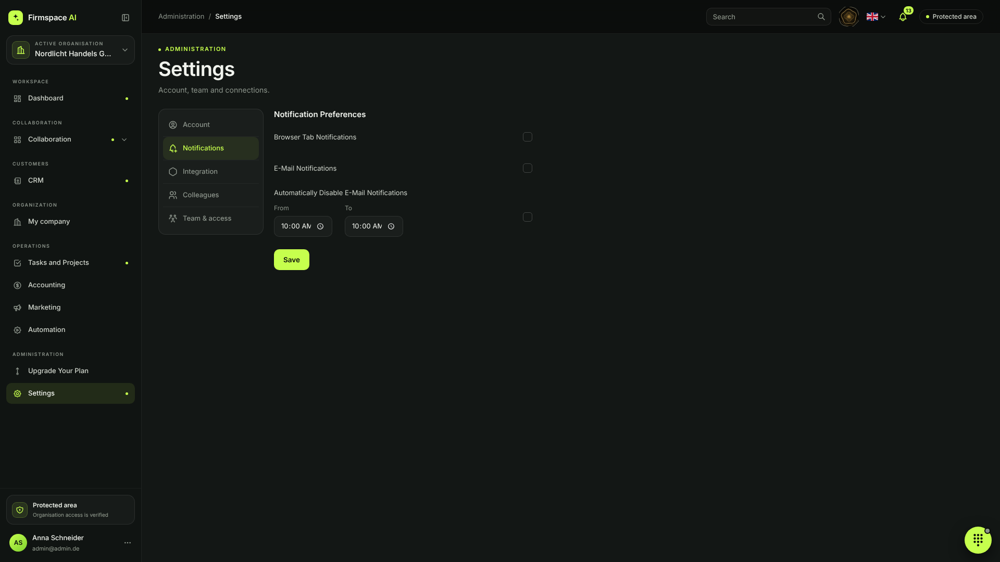

- **Длительность:** 4 с
- **Озвучка (RU):** Уведомления: выбираем, о чём и как узнавать — в приложении, по почте или в Telegram.
- **Подпись на экране (EN):** Notifications
- **Промпт для анимации:** Toggle switches flip one by one from off to on with lime transitions.

### 63 · 05:03–05:09 · settings-integrations
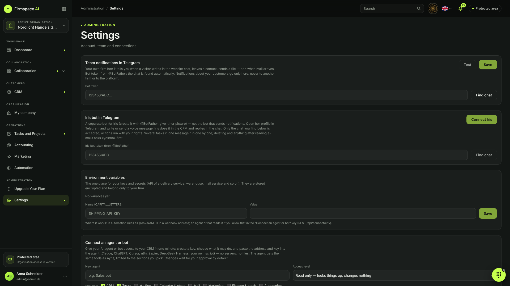

- **Длительность:** 6 с
- **Озвучка (RU):** Интеграции: телефония, SMS, Viber, Telegram, Messenger, WhatsApp, онлайн-чат для сайта, службы доставки, платежи и маркетплейсы.
- **Подпись на экране (EN):** Integrations
- **Промпт для анимации:** Integration logos orbit then settle into a grid; connection lines light up between the CRM core and each service.

### 64 · 05:09–05:13 · settings-colleagues
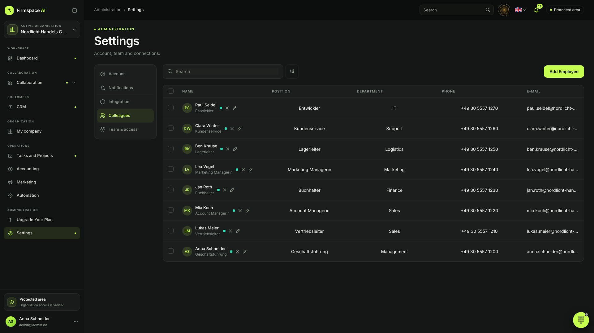

- **Длительность:** 4 с
- **Озвучка (RU):** Коллеги: добавляем сотрудников и управляем их данными.
- **Подпись на экране (EN):** Colleagues
- **Промпт для анимации:** Employee rows stagger in; add-employee button pulses once.

### 65 · 05:13–05:18 · settings-team
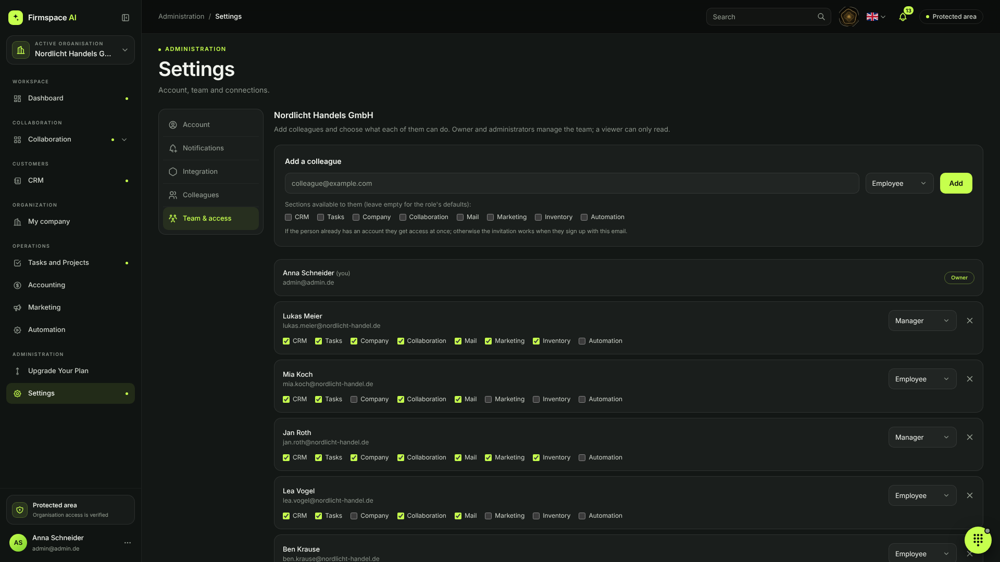

- **Длительность:** 5 с
- **Озвучка (RU):** Команда и доступ: роли владельца, админа, менеджера, сотрудника и наблюдателя, выборочный доступ к разделам.
- **Подпись на экране (EN):** Roles & permissions
- **Промпт для анимации:** Role badges slide in; permission checkboxes toggle on and off in a wave across the matrix.

### 66 · 05:18–05:23 · settings-import
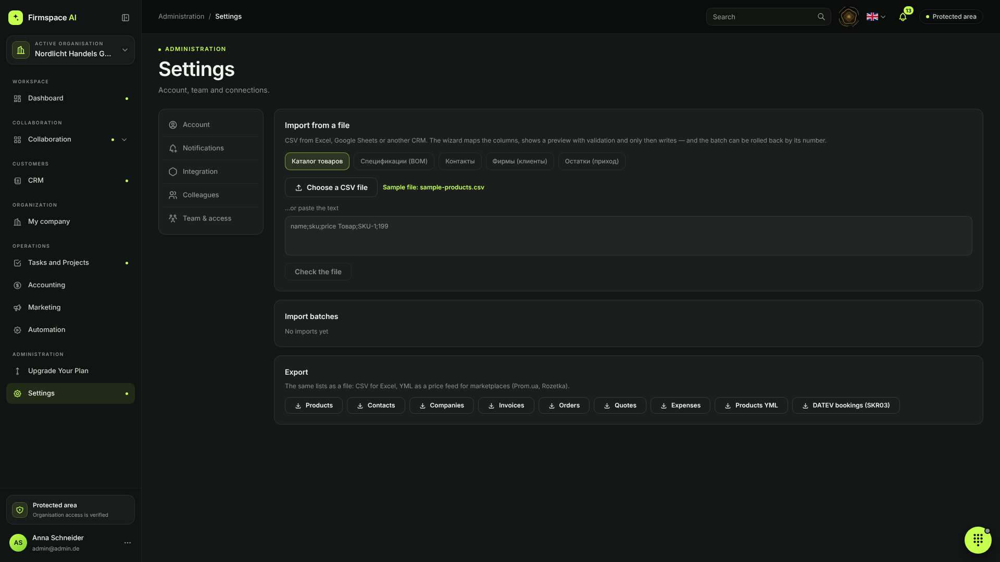

- **Длительность:** 5 с
- **Озвучка (RU):** Импорт данных из CSV и Excel: товары, контакты, компании, остатки и проводки DATEV — переезд в CRM без ручного ввода.
- **Подпись на экране (EN):** Import your data
- **Промпт для анимации:** A file icon drops onto the dropzone, a progress ring fills, rows stream into a table below.

## Admin

### 67 · 05:23–05:28 · admin-panel
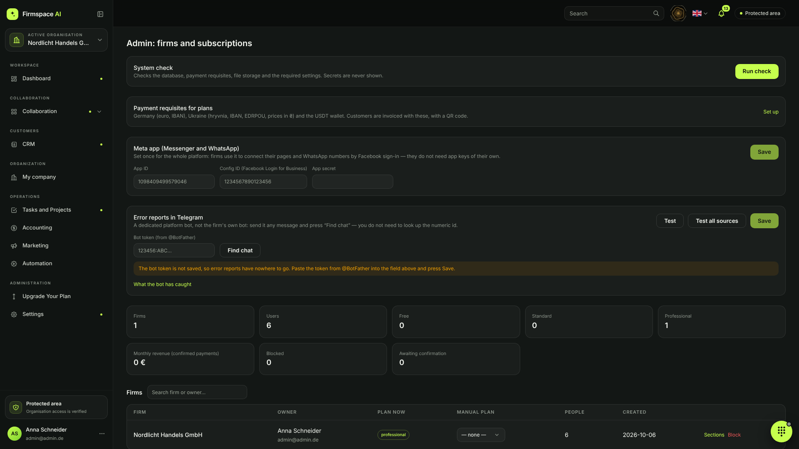

- **Длительность:** 5 с
- **Озвучка (RU):** Панель администратора платформы: проверки, журнал ошибок и управление разделами — полный контроль над системой.
- **Подпись на экране (EN):** Admin & monitoring
- **Промпт для анимации:** Health-check indicators run through a sequence turning green; log lines scroll subtly.

## Outro

### 68 · 05:28–05:33 · outro-card
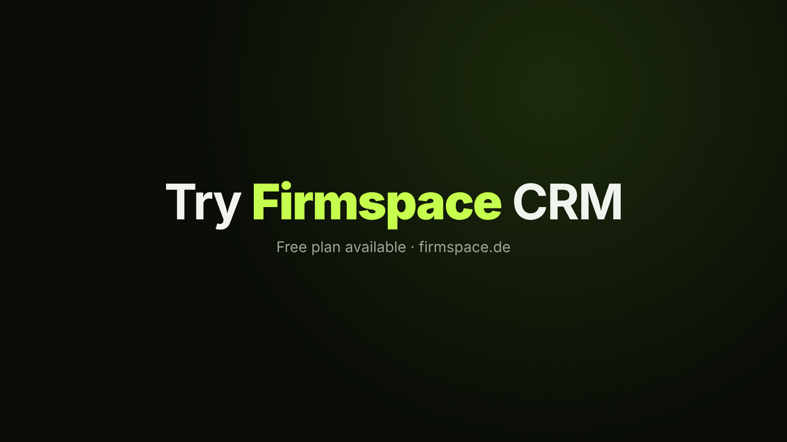

- **Длительность:** 5 с
- **Озвучка (RU):** Firmspace CRM: всё для роста бизнеса в одном месте. Попробуйте бесплатно — тариф Free доступен уже сегодня.
- **Подпись на экране (EN):** Try Firmspace CRM — free plan available
- **Промпт для анимации:** Logo and tagline fade in over a slow-moving lime gradient; a call-to-action button pulses once with a ripple; camera slowly pulls back and fades to black.
